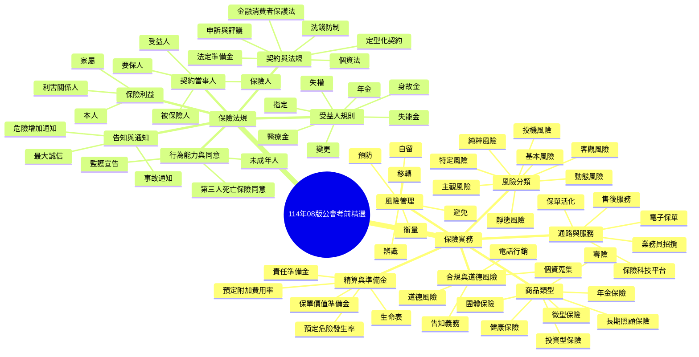

# 114年08版公會考前精選講義

來源：
- `114年08版公會考前精選-1-18.pdf`
- `114年08版公會考前精選-19-43.pdf`

這份講義將兩份題庫重組為「觀念先行、題目驗證」的學習路線。
前半部整理保險實務、風險管理、商品與服務；後半部整理保險法規、契約關係與合規重點。

## 一、總覽地圖

## 二、保險實務講義

### 1. 風險的基本概念

風險不是單純的「危險」，而是「損失發生的不確定性」。
題庫最常考的是四組分類：

- 依是否可衡量
  - 客觀風險：可以觀察、可以衡量，結果較一致。
  - 主觀風險：與個人心理、態度、情緒有關。
- 依損失性質
  - 投機風險：可能損失，也可能獲利。
  - 純粹風險：只有損失機會，沒有獲利機會。
- 依事故原因
  - 靜態風險：如地震、海嘯、戰爭等，偏隨機、外生。
  - 動態風險：與社會變動、經濟變化相關。
- 依影響範圍
  - 基本風險：範圍大、難控制。
  - 特定風險：範圍小、較容易控制，常屬純粹風險。

### 2. 風險衡量與風險管理

風險衡量的核心公式是：

- 損失成本 = 損失頻率的預期值 x 損失幅度的預期值

常見概念：

- 頻率：一年內發生幾次，或發生機率多高。
- 幅度：每次發生損失多少金額。
- 衡量結果常分為
  - 特別嚴重風險：頻率高、幅度高。
  - 重要風險：頻率高幅度低，或頻率低幅度高。
  - 不重要風險：頻率低、幅度低。

風險管理方法常記成四字：

- 避免
- 預防
- 自留
- 移轉

題庫常把「保險」放在移轉之下，也就是把損失轉由保險制度分攤。

### 3. 生命表、費率與準備金

這一段是壽險精算的主軸，題目常用不同名詞包裝，但邏輯一致。

- 生命表：用來推估死亡率、存活率，也是保費與準備金的重要基礎。
- 經驗生命表：由歷史經驗統計而來，常用於費率、準備金與績效評估。
- 預定危險發生率：保險公司在設計保費時，對死亡或事故機率的預估。
- 預定附加費用率：保單管理、招攬、行政等成本的預估。
- 責任準備金：為未來契約責任預先提存的金額。
- 保單價值準備金：與契約累積價值相關，常出現在年金與壽險商品規範中。

記憶重點：

- 費率設計看的是「收支相等、互助分攤」。
- 準備金提存偏保守，通常會採較高死亡率、較低利率的假設。
- 投資型、年金型商品會特別強調預定利率、宣告利率、附加費用率與死亡率之間的關係。

### 4. 年金與壽險商品

常考的年金觀念：

- 年金保險是以生存作為給付條件。
- 最後生存者年金：多人中只要還有一人存活，就繼續給付。
- 連生共存年金：多人都存活才給付。
- 年金金額、費率、準備金，會受到預定利率與生命表影響。

常考的壽險觀念：

- 死亡保險、健康保險、生存保險，是人壽保險常見分類。
- 人身保險不是只有「死亡給付」，也包括醫療、失能、長照、年金等設計。
- 傳統壽險與利率變動型年金的差異，在於利率、準備金與給付機制的彈性。

### 5. 健康、長照、團體與政策型保險

題庫把實務商品整理得很完整，常考重點如下：

- 健康保險：補償傷害、疾病造成的醫療與工作損失。
- 長期照顧保險：核心在「生活自理能力」與「認知功能」是否達到約定標準。
- 團體保險：常依團體風險、薪資、職務性質與保額設計費率。
- 學生團體保險：主管機關、給付項目、受益人與專戶機制是常考點。
- 微型保險：對經濟弱勢族群提供基本保障，附加費用與風險控管有限制。
- 國民年金、就業保險、勞保職災：屬於社會保險概念，常與商業保險做比較。

### 6. 業務員招攬、售後與保戶規劃

這份題庫不只考法規，也很重視「業務實務」。

- 招攬時要重視受益人、投保金額、職業、既往症與家族病史。
- 售後服務不是交保單就結束，而是開始協助客戶做保額調整、附約補強、保費規劃與借款建議。
- 生活規劃書的目的，是把家庭未來可能發生的費用具體化。
- 保戶常見經濟準備包括
  - 住宅費用
  - 子女教育與婚嫁費用
  - 緊急預備金
  - 遺族生活資金

### 7. 科技、平台與合規

題庫後段大量出現保險科技與數位服務，常考重點如下：

- 電子保單與保險存摺，都是解決查詢、驗證、保存與整合保單資訊的工具。
- 保險科技共享平台的功能，常圍繞身分驗證、保單查詢、理賠協助與聯盟鏈服務。
- 外溢效果商品的目的，不是取代人，而是用科技引導健康行為與風險預防。
- 電話行銷、個資蒐集、客訴流程、內控稽核，都屬合規重點。

## 三、保險法規講義

### 1. 契約當事人與關係人

人身保險契約可以先分成兩層：

- 當事人
  - 保險人
  - 要保人
- 關係人
  - 被保險人
  - 受益人

基本定義：

- 保險人：經營保險事業的人。
- 要保人：申請訂立契約並負繳費義務的人，對被保險人要有保險利益。
- 被保險人：生命、身體成為保險標的的人，只能是自然人。
- 受益人：事故發生後享有請求保險金的人，可以是自然人或法人，但要注意法規限制。

受益人的產生方式：

- 約定
- 指定
- 法定

### 2. 要保人、被保險人與同意

法規最常考的不是定義本身，而是「誰可以做什麼」。

- 要保人須具有行為能力。
- 未成年人、限制行為能力人、受監護宣告者，涉及契約成立時通常要看法定代理人或其法定程序。
- 第三人死亡保險契約，與被保險人的同意密切相關。
- 受益人指定或變更，通常需要依規定通知保險人，否則不能對抗第三人。

### 3. 保險利益

保險利益是人身保險合法性的核心。

常見可有保險利益的對象：

- 本人
- 家屬
- 生活費、教育費所仰給之人
- 其他具有密切利害關係者

實務上要避免「沒有保險利益卻替他人投保」的情形，這是道德風險與違法風險的交會點。

### 4. 告知義務、通知義務與最大誠信

這部分是人身保險法規的高頻考點。

- 告知義務：訂約時，要保人或被保險人對重要事項要誠實揭露。
- 通知義務：事故發生、危險增加等情形，依規定要向保險人通知。
- 最大誠信原則：不是單方面要求保戶誠實，保險人與業務員也要如實、完整處理資訊。

可用一條線記憶：

- 訂約前看告知
- 契約中看通知
- 發生事故看理賠與文件

### 5. 受益人規則

受益人是這份題庫最愛考的主題之一。

重點整理：

- 受益人有疑義時，法律推定要保人。
- 保險金種類不同，受益人規則也不同。
- 失能、醫療、年金等生存給付，受益人常限被保險人本人，且不得任意事後變更。
- 受益人經指定後，變更通常要符合規定程序並通知保險人。
- 若受益人故意致被保險人於死，通常會喪失受益權。
- 若要保人故意致被保險人於死，保險人通常不負給付責任，且相關價值準備金會有特定處理方式。

### 6. 契約成立、效力與解釋

幾個容易混淆的點：

- 保險契約通常以保險單或暫保單等文件記載。
- 第一筆保費繳交，不代表必然立刻完成所有效力判斷，仍要看契約成立與保險人承保意思。
- 定型化契約是保險法規與消保法交會的地帶。
- 契約條款有疑義時，原則上作有利於被保險人的解釋。

### 7. 保險業組織、代收保費與準備金

題庫會把保險公司、合作社、經紀人、代理人混在一起考。

重點：

- 保險業的組織型態、合作社條件、保單紅利規則都可能出題。
- 代收保費的人員範圍要分清楚，不能把沒有授權的人混進來。
- 法定準備金與保單價值準備金不要混成同一個概念。
- 資金運用、海外投資、重大訊息揭露、盈餘分派，也屬法規重點。

### 8. 金融消費者保護、個資、洗錢與爭議處理

這一組是近年很重要的合規主題。

- 金融消費者保護法：契約條款不能顯失公平，條款有疑義要保護消費者。
- 廣告與說明：不得虛偽、誤導，且實際義務不得低於廣告內容。
- 個資法：蒐集、利用、特種個資、保存年限，都會出現在保險核保與理賠流程。
- 洗錢防制：一定金額以上交易、客戶確認、可疑交易申報，都要掌握期限與程序。
- 金融消費爭議：評議、法院核可、效力，都屬高頻題型。

### 9. 內容充分性審查

這份講義已經能當考前主架構，但若目標是「提高答題穩定度」，還需要再補三類知識點：

- 流程型知識點
  - 招攬 -> 核保 -> 繳費 -> 保單交付 -> 售後服務 -> 保單活化/轉換
  - 告知 -> 通知 -> 理賠 -> 爭議處理
  - 蒐集個資 -> 電銷/招攬 -> 核保理賠 -> 保存與申報
- 對照型知識點
  - 生命表、預定利率、預定危險發生率、責任準備金、保單價值準備金
  - 保險利益、保險金信託、受益人指定與變更
  - 商業保險、社會保險、團體保險、微型保險、投資型保險
- 例外型知識點
  - 受益人死亡或故意致害時的權利歸屬
  - 未成年人、限制行為能力人、受監護宣告者的投保效力
  - 定型化契約、金融消保、個資、洗錢的法定例外

### 10. 保險業專用名詞說明

以下名詞是題庫最常反覆出現、也最容易混淆的部分。建議把它當成查表區。

- 保險人：經營保險事業的人，也就是保險公司或法定可經營保險之主體。
- 要保人：申請訂立保險契約並負繳費義務的人，且對被保險人要有保險利益。
- 被保險人：生命、身體或健康受保險保障的人。
- 受益人：保險事故發生後，依法或依約請求保險金的人。
- 保險利益：與某人生命、身體、財產或經濟利益具有法律上可保護關係，沒有保險利益通常不能任意投保他人生命。
- 要保書：要保人向保險公司申請投保時填寫的書面資料，是核保與告知的重要基礎。
- 保單：保險契約成立後由保險人簽發的憑證，常作為契約內容的主要證明。
- 暫保單：正式保單尚未簽發前，先行提供的臨時保障文件。
- 核保：保險公司審查要保案件風險，決定承保、加費、除外或拒保的過程。
- 招攬報告書：業務員對招攬經過、被保險人狀況等所作的書面報告，屬重要內部文件。
- 體檢書：核保時用來判斷健康風險的重要資料，常與告知書、招攬報告書一起考。
- 告知義務：要保人或被保險人對重要事項，如既往症、職業、健康狀況，應誠實說明。
- 通知義務：契約成立後，若有危險增加、事故發生等情形，依法或依約應通知保險人。
- 保費：要保人為取得保險保障所支付的費用。
- 純保費：對應風險本身的費用，不含營運、招攬、管理成本。
- 總保費：純保費加上附加費用後的實際收費。
- 預定危險發生率：保險公司計算費率時，預估死亡、失能或事故發生機率。
- 預定附加費用率：保險公司預先估計招攬、行政、管理等費用的比率。
- 預定利率：保險公司在計算保費或準備金時，預先採用的利率假設。
- 生命表：統計不同年齡死亡率、存活率的表，用來計算保費與準備金。
- 經驗生命表：依實際保戶經驗統計而成的生命表，常用於費率或準備金參考。
- 責任準備金：保險公司為未來契約責任預先提存的金額。
- 保單價值準備金：保單累積後形成的價值準備，與解約、借款、年金或保單活化常相關。
- 保單借款：保戶可用保單價值作為擔保向保險公司借款。
- 保費自動墊繳：保戶未繳保費時，保險公司以保單價值準備金代墊保費。
- 保單活化：把失去效率或保障不足的舊保單，透過轉換、增額或重新規劃使其重新發揮功能。
- 保單轉換：將既有保單轉成另一種保單，常涉及原保單權益與新保單比較。
- 保險金信託：把未來保險金交由受託人依信託契約管理與給付，以保護受益人權益。
- 保單紅利：分紅保單依契約及經營成果分配給保戶的利益。
- 分紅保單：保戶可依契約分享保險公司經營成果的商品。
- 年金保險：以生存為給付條件的保險，重點在退休、長壽與現金流安排。
- 失能保險：被保險人因失能而符合約定狀態時給付的保險。
- 醫療保險：補償因疾病或傷害所生醫療費用的保險。
- 長期照顧保險：被保險人達約定的生活自理或認知障礙狀態時給付。
- 微型保險：針對經濟弱勢或特定身分者提供基本保障的低保費商品。
- 團體保險：以團體為投保基礎，通常依團體條件決定費率與保額。
- 投資型保險：保費部分或全部連結投資標的，投資風險由要保人或被保險人承擔較多。
- 電子保單：以電子形式簽發的保單，具保單功能，但保管與驗證方式不同於紙本。
- 保險存摺：整合個人保單資訊的平台工具，常用於查詢、驗證與保單彙整。
- 保險科技平台：結合數位工具、聯盟鏈、資料驗證與線上服務的保險共用平台。
- 外溢效果：保險商品透過行為回饋，促使保戶改善健康或風險習慣。
- 道德風險：因投保後行為改變，反而提高損失機率的現象，例如故意不維護標的。
- 逆選擇：風險高的人比風險低的人更積極投保，導致保險公司風險失衡。
- 定型化契約：由一方預先擬定、他方只能整體接受或拒絕的契約。
- 公平待客原則：金融服務業對消費者應公平、合理、透明地提供商品與服務。

### 11. 名詞對照表

| 容易混淆 | 並排比較 | 一句話記法 |
|---|---|---|
| 保險人 / 要保人 | 保險人是經營保險的人；要保人是投保並繳費的人 | 前者賣保險，後者買保險 |
| 要保人 / 被保險人 | 要保人是契約當事人；被保險人是風險承受對象 | 一個簽約，一個被保障 |
| 被保險人 / 受益人 | 被保險人是標的；受益人是領保險金的人 | 一個出事，一個領錢 |
| 要保書 / 保單 / 暫保單 | 要保書是申請文件；保單是正式契約憑證；暫保單是臨時保障 | 申請 -> 臨時 -> 正式 |
| 純保費 / 總保費 | 純保費只含風險成本；總保費再加附加費用 | 風險價 vs. 實收價 |
| 責任準備金 / 保單價值準備金 | 前者是未來責任提存；後者是保單累積價值 | 一個保責任，一個保價值 |
| 告知義務 / 通知義務 | 告知義務在訂約時；通知義務在事故、危險變更時 | 前看投保，後看變動 |
| 保險利益 / 受益人資格 | 保險利益是能不能投保；受益人資格是能不能領錢 | 前者管投保，後者管請領 |
| 連生共存年金 / 最後生存者年金 | 前者要全部生存才給付；後者只要還有一人存活就給付 | 全活才給 vs. 留一人就給 |
| 分紅保單 / 不分紅保單 | 分紅保單可分享經營成果；不分紅保單不分享 | 有紅利 vs. 沒紅利 |
| 定型化契約 / 個別磋商條款 | 定型化是先擬好的格式；個別磋商是雙方談過的特別約定 | 套版 vs. 談定 |
| 道德風險 / 逆選擇 | 道德風險是投保後行為變差；逆選擇是高風險者較愛投保 | 前者在投保後，後者在投保前 |

### 12. 法規數字表

| 主題 | 數字 / 期限 | 題庫重點 |
|---|---|---|
| 危險增加通知 | 知悉後 10 日內 | 保險契約所載危險增加時的通知期限 |
| 保險金給付 | 收齊文件後 15 日內 | 除情況特殊外，逾期應加計利息 |
| 定型化契約審閱期 | 30 日內 | 企業經營者應提供合理期間審閱 |
| 一定金額以上通貨交易 | 新台幣 50 萬元以上 | 依洗錢防制規定應確認身分並留存紀錄 |
| 可疑交易申報期限 | 2 個營業日內 | 由專責主管核定後立即申報 |
| 海外投資上限 | 保險業資金之 45% | 題庫常與資金運用一起考 |
| 金融債券 / CDR / 可轉讓定存單上限 | 保險業資金之 35% | 資金運用比例題常考 |
| 法定盈餘公積 | 20% | 完納稅捐後分派盈餘先提 |
| 就業保險費率 | 1% | 目前題庫直接問百分比 |
| 勞保普通事故保費個人負擔 | 20% | 題目常問勞工自己負擔比率 |
| 長照生理功能障礙 | 6 項 ADL 中至少 3 項，且通常不得超過 6 個月 | 進食、移位、如廁、沐浴、平地移動、更衣 |
| 長照認知功能障礙 | CDR 中度以上 | 失智狀態與專科醫師判定是重點 |
| 國民年金投保年齡 | 25 歲以上未滿 65 歲 | 題庫常考與其他社會保險對照 |
| 傳統人壽死亡給付年齡門檻 | 未滿 15 歲死亡時，除喪葬費用給付外，其餘死亡給付於滿 15 歲始生效力 | 這題很常出現 |
| 保費自動墊繳 / 保單借款 | 以保單價值準備金為基礎 | 與保單活化、保單維持一起考 |

### 13. 高頻錯題整理表

| 常見陷阱 | 正確觀念 | 為什麼容易錯 |
|---|---|---|
| 受益人有疑義時推定被保險人 / 法定繼承人 | 應推定要保人 | 題庫故意把關係人混在一起 |
| 保險人可為自然人 | 保險人通常為依法設立的保險業主體 | 容易把一般自然人與保險業混淆 |
| 保險合作社可簽訂分紅或不分紅保單 | 保險合作社以參加保單紅利者為限 | 題目常把公司與合作社對調 |
| 生命表是依收支平等原則統計出來的 | 生命表是死亡率 / 存活率的統計表 | 容易把費率原則與統計工具混成一題 |
| 定型化契約條款顯失公平時整份契約無效 | 通常是該部分約定無效 | 很多人會直接把整份契約判死 |
| 要保人故意致被保險人於死，仍返還所繳保費 | 通常不給付保險金，並依規定處理保單價值準備金 | 題目常用「退保費」誘答 |
| 受益人經指定後就永遠不能變更 | 保險事故發生前，依規定仍有變更可能 | 題目常把「指定」和「不可變更」綁在一起 |
| 電話行銷過程不得錄音並備份 | 電銷規範重點在告知、確認、保存程序，不能把「不得錄音」當原則 | 常用個資保護語句誤導 |
| 保險經紀人可代收保險費 | 題庫中授權代收重點是保險公司授權之業務員、保險代理人及其所屬業務員 | 經紀人常被誤列進去 |
| 金融機構可在一個月內申報可疑交易 | 應依規定在 2 個營業日內申報 | 期限題最容易失分 |
| 保險業利用金融科技的目的在於完全取代人的服務 | 正確方向是提升效率、協助服務，不是完全取代人 | 這是題庫標準反向陷阱 |
| 保險契約有疑義時由保險人自行解釋 | 應做有利被保險人的解釋 | 定型化契約與消保題常這樣考 |

## 四、知識鍊補強

下面這幾條是最值得補起來的學習鏈，建議用「前項懂了，後項才會穩」的方式背。

### 知識鍊 1：風險管理主鏈

風險定義 -> 風險分類 -> 風險衡量 -> 損失成本 -> 風險管理方法 -> 保險移轉

### 知識鍊 2：壽險精算主鏈

生命表 -> 死亡率/存活率 -> 預定危險發生率 -> 預定利率與附加費用率 -> 保費 -> 責任準備金 -> 保單價值準備金

### 知識鍊 3：契約成立主鏈

要保人與保險利益 -> 行為能力 -> 要保書與告知 -> 承保與核保 -> 保單簽發 -> 保費繳納 -> 契約效力

### 知識鍊 4：受益人主鏈

受益人指定 -> 變更通知 -> 受益人權利 -> 故意致死或故意傷害 -> 受益權喪失 -> 保險金改由其他應得之人領取

### 知識鍊 5：合規主鏈

個資蒐集 -> 廣告與說明 -> 電話行銷 -> 洗錢防制 -> 申訴處理 -> 評議核可 -> 公平待客原則

### 知識鍊 6：招攬核保主鏈

投保動機 -> 保險利益 -> 風險選擇 -> 體檢/告知/招攬報告 -> 核保判斷 -> 契約成立 -> 保單交付

### 知識鍊 7：保單管理主鏈

繳費方式 -> 代收保費 -> 保費不足/墊繳 -> 保單借款 -> 保單活化 -> 轉換/變更 -> 電子保單/保險存摺

### 知識鍊 8：保險法規對照主鏈

契約當事人 -> 保險利益 -> 行為能力 -> 告知與通知 -> 受益人規則 -> 準備金與理賠 -> 消保與爭議處理

## 五、考前速記

- 風險衡量看頻率與幅度。
- 風險管理記避、預、防、自留、移轉。
- 年金看生存條件，壽險看死亡給付，健康保險看疾病與傷害。
- 要保人要有保險利益與行為能力。
- 受益人有疑義時，推定要保人。
- 受益人變更要注意通知與對抗問題。
- 契約條款有疑義，優先做有利被保險人的解釋。
- 個資、洗錢、廣告、電話行銷都屬保險合規必考區。
- 如果題目在問「流程」，先找前後步驟。
- 如果題目在問「誰可以做」，先找當事人與關係人。
- 如果題目在問「例外」，先找受益人、未成年人、法定通知與消保條款。

## 六、建議讀法

1. 先背「分類與定義」。
2. 再背「公式與制度」。
3. 最後用題庫驗證「例外規則」與「法規數字」。
4. 遇到混淆題，先問自己：這題是在考風險、商品、契約、受益人，還是合規。
